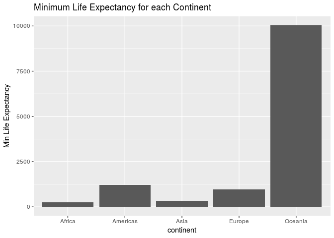
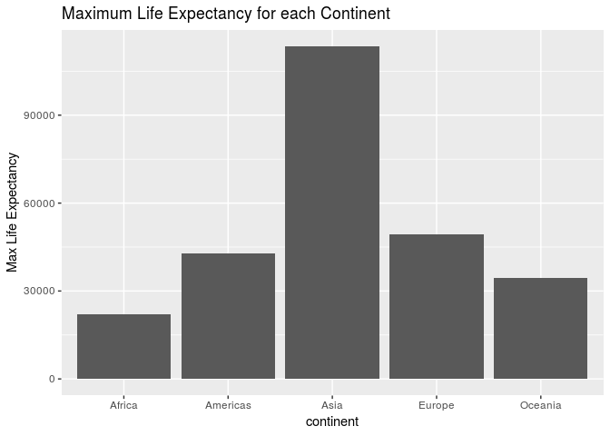
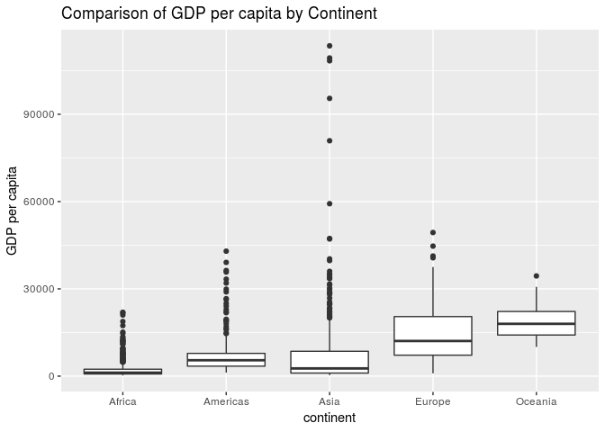
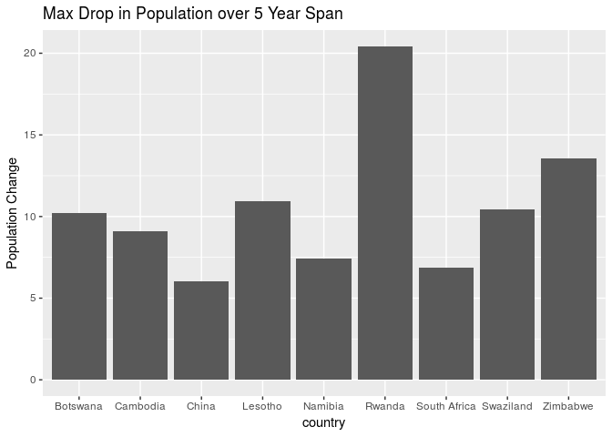
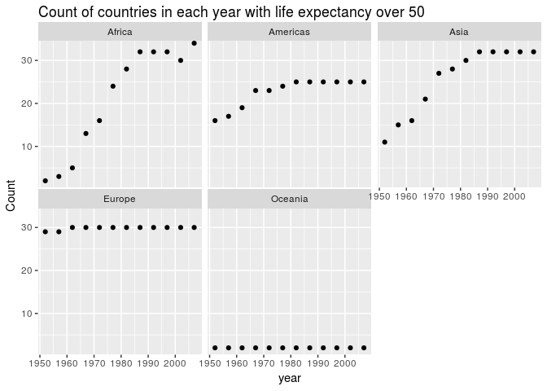

```r
suppressPackageStartupMessages(library(tidyverse))
```

```
## Warning: replacing previous import by 'tibble::as_tibble' when loading
## 'broom'
```

```
## Warning: replacing previous import by 'tibble::tibble' when loading 'broom'
```

```r
suppressPackageStartupMessages(library(gapminder))
```


## R Markdown


```r
library(gapminder)
library(tidyverse)
```

# Tasks

## Task 1 

The first thing I will do is extract the minimum and maximum GDP per capita for each of the continents. I then extract the minimum and maximum life expectancies across all the continents. I will use the group by and summarise functions to extract the necessary data.  I then plot both the min and max life expectancies for all continents.

```r
df <- gapminder %>%
  group_by(continent) %>%
  summarize(min = min(gdpPercap),max = max(gdpPercap)) 
df # print table
```

```
## # A tibble: 5 x 3
##   continent    min     max
##   <fct>      <dbl>   <dbl>
## 1 Africa      241.  21951.
## 2 Americas   1202.  42952.
## 3 Asia        331  113523.
## 4 Europe      974.  49357.
## 5 Oceania   10040.  34435.
```

```r
df2 <- df %>%
  summarize(minAll = min(min),maxAll = max(max))
df2 # print table
```

```
## # A tibble: 1 x 2
##   minAll  maxAll
##    <dbl>   <dbl>
## 1   241. 113523.
```

```r
ggplot(df, aes(continent,min)) + 
  geom_bar(stat = "identity") + 
  ggtitle("Minimum Life Expectancy for each Continent") + 
  ylab("Min Life Expectancy") # plots min life expectancy for each continent
```

<!-- -->

```r
ggplot(df, aes(continent,max)) + 
  geom_bar(stat = "identity") + 
  ggtitle("Maximum Life Expectancy for each Continent") + 
  ylab("Max Life Expectancy") # plots min life expectancy for each continent
```

<!-- -->

## Task 2

I now compare the spread of GDP per capita across the various continents, by computing the maximum and minimum GDP per capita and taking the difference. I used a boxplot since it allows you to compare spread of data very easily. 

```r
df <- gapminder %>%
  group_by(continent) %>%
  summarize(diff = max(gdpPercap) - min(gdpPercap)) # compute difference between max and min GDP per capita for each continent
df # show table
```

```
## # A tibble: 5 x 2
##   continent    diff
##   <fct>       <dbl>
## 1 Africa     21710.
## 2 Americas   41750.
## 3 Asia      113192.
## 4 Europe     48384.
## 5 Oceania    24396.
```

```r
ggplot(gapminder, aes(continent, gdpPercap)) + 
  geom_boxplot() + ggtitle("Comparison of GDP per capita by Continent") + 
  ylab("GDP per capita") 
```

<!-- -->

As we can see from both the boxplots and the table, Asia has by far the largest spread of GDP per capita's.

Here we examine the number of countries in each continent that have a life expectancy over 50, and how this changes over time.

## Task 3

Here I compare how mean life expectancy for each continent is changing over time. I chose to use the average life expectancy to avoid having the plots become too cluttered. As well, I chose to use scatterplots, as I am plotting 2 quantitative variables.

```r
df <- gapminder %>%
  group_by(year,continent) %>%
  summarize(meanlifeExp = mean(lifeExp)) # group by continent and year, and compute mean life expectnacy for each grouping
df # print table
```

```
## # A tibble: 60 x 3
## # Groups:   year [?]
##     year continent meanlifeExp
##    <int> <fct>           <dbl>
##  1  1952 Africa           39.1
##  2  1952 Americas         53.3
##  3  1952 Asia             46.3
##  4  1952 Europe           64.4
##  5  1952 Oceania          69.3
##  6  1957 Africa           41.3
##  7  1957 Americas         56.0
##  8  1957 Asia             49.3
##  9  1957 Europe           66.7
## 10  1957 Oceania          70.3
## # ... with 50 more rows
```

```r
ggplot(df, aes(year, meanlifeExp)) + 
  geom_point() + 
  facet_wrap(~ continent) + 
  ggtitle("Mean Life Expectancy versus Year for each Continent") +
  ylab("Mean Life Expectancy") # plot mean life expectancy versus year for each continent
```

<!-- -->

Overall, it seems like all continents have gradually increasing life expectancies. However, Africa seems to have reasonably leveled off in roughly the last 20 years.

## Task 4


```r
df <- gapminder %>%
  group_by(year,continent) %>%
  filter(lifeExp > 50)
df <- count(df) # stores number of countries with a life expectancy > 50 in a given continent, for each year, in a variable called n
df # prints table
```

```
## # A tibble: 60 x 3
## # Groups:   year, continent [60]
##     year continent     n
##    <int> <fct>     <int>
##  1  1952 Africa        2
##  2  1952 Americas     16
##  3  1952 Asia         11
##  4  1952 Europe       29
##  5  1952 Oceania       2
##  6  1957 Africa        3
##  7  1957 Americas     17
##  8  1957 Asia         15
##  9  1957 Europe       29
## 10  1957 Oceania       2
## # ... with 50 more rows
```

```r
ggplot(df, aes(year, n)) + 
  geom_point() + 
  facet_wrap(~ continent) + 
  ggtitle("Count of countries in each year with life expectancy over 50") + 
  ylab("Count") # rename n to count
```

<!-- -->

As we can see, Africa and Asia have the largest increase over time in terms of the number of countries having life expectancies over 50. The Americas have a smaller change, and Europe and Oceania have almost no change.

## Task 5

I chose to attempt the open-ended task. I took the difference between lag life expectancy and life expectancy, and sort countries in descending order, in order to determine which countries had the largest drops in life expectancy (over 5 year span). I only plotted those countries where the life expectancy dropped by more than 6, to keep the plot from becoming too Scluttered.

```r
df <- gapminder %>% # extracts and sorts largest drops in life expectancy by country
  group_by(country) %>%
  mutate(change = lag(lifeExp) - lifeExp) %>%
  filter(!is.na(change), change > 6) %>%
  summarize(popIncrease = max(change)) %>% 
  arrange(desc(popIncrease))
df # print out table
```

```
## # A tibble: 9 x 2
##   country      popIncrease
##   <fct>              <dbl>
## 1 Rwanda             20.4 
## 2 Zimbabwe           13.6 
## 3 Lesotho            11.0 
## 4 Swaziland          10.4 
## 5 Botswana           10.2 
## 6 Cambodia            9.10
## 7 Namibia             7.43
## 8 South Africa        6.87
## 9 China               6.05
```

```r
ggplot(df, aes(country,popIncrease)) +  
  geom_bar(stat = "identity") + 
  ggtitle("Max Drop in Population over 5 Year Span") + 
  ylab("Population Change") # to create bar chart comparing country life expectancy
```

<!-- -->

As we can see, Rwanda had the largest drop in life expectancy across all countries. This is likely due the civil war in the country in the early 90's. Various other countries on this list had other horrific events happen as well.
