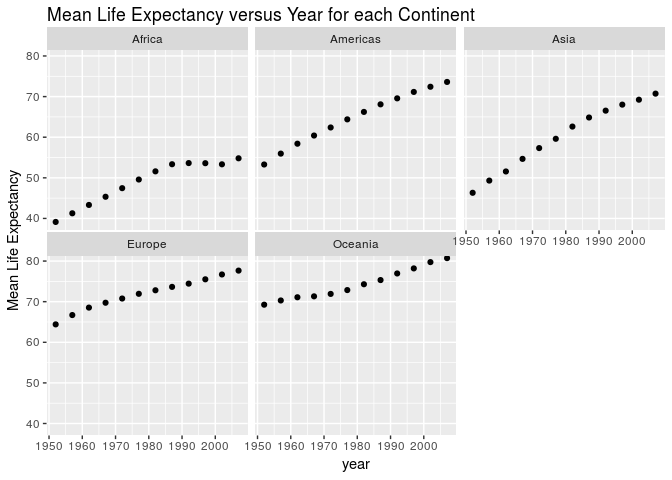

```r
suppressPackageStartupMessages(library(tidyverse))
```

```
## Warning: replacing previous import by 'tibble::as_tibble' when loading
## 'broom'
```

```
## Warning: replacing previous import by 'tibble::tibble' when loading 'broom'
```

```r
suppressPackageStartupMessages(library(gapminder))
```


## R Markdown


```r
library(gapminder)
library(tidyverse)
```

# Tasks

## Task 1 

The first thing I will do is extract the minimum and maximum GDP per capita for each of the continents. I then extract the minimum and maximum life expectancies across all the continents. I will use the group by and summarise functions to extract the necessary data.  I then plot both the min and max life expectancies for all continents.

```r
df <- gapminder %>%
  group_by(continent) %>%
  summarize(min = min(gdpPercap),max = max(gdpPercap)) 
knitr::kable(df) # print table
```


continent           min         max
----------  -----------  ----------
Africa         241.1659    21951.21
Americas      1201.6372    42951.65
Asia           331.0000   113523.13
Europe         973.5332    49357.19
Oceania      10039.5956    34435.37

```r
df2 <- df %>%
  summarize(minAll = min(min),maxAll = max(max))
knitr::kable(df2) # print table
```


   minAll     maxAll
---------  ---------
 241.1659   113523.1

```r
ggplot(df, aes(continent,min)) + 
  geom_bar(stat = "identity") + 
  ggtitle("Minimum Life Expectancy for each Continent") + 
  ylab("Min Life Expectancy") # plots min life expectancy for each continent
```

<!-- -->

```r
ggplot(df, aes(continent,max)) + 
  geom_bar(stat = "identity") + 
  ggtitle("Maximum Life Expectancy for each Continent") + 
  ylab("Max Life Expectancy") # plots min life expectancy for each continent
```

<!-- -->

## Task 2

I now compare the spread of GDP per capita across the various continents, by computing the maximum and minimum GDP per capita and taking the difference. I used a boxplot since it allows you to compare spread of data very easily. 

```r
df <- gapminder %>%
  group_by(continent) %>%
  summarize(diff = max(gdpPercap) - min(gdpPercap)) # compute difference between max and min GDP per capita for each continent
knitr::kable(df) # show table
```


continent         diff
----------  ----------
Africa        21710.05
Americas      41750.02
Asia         113192.13
Europe        48383.66
Oceania       24395.77

```r
ggplot(gapminder, aes(continent, gdpPercap)) + 
  geom_boxplot() + ggtitle("Comparison of GDP per capita by Continent") + 
  ylab("GDP per capita") 
```

<!-- -->

As we can see from both the boxplots and the table, Asia has by far the largest spread of GDP per capita's.

Here we examine the number of countries in each continent that have a life expectancy over 50, and how this changes over time.

## Task 3

Here I compare how mean life expectancy for each continent is changing over time. I chose to use the average life expectancy to avoid having the plots become too cluttered. As well, I chose to use scatterplots, as I am plotting 2 quantitative variables.

```r
df <- gapminder %>%
  group_by(year,continent) %>%
  summarize(meanlifeExp = mean(lifeExp)) # group by continent and year, and compute mean life expectnacy for each grouping
knitr::kable(df) # print table
```


 year  continent    meanlifeExp
-----  ----------  ------------
 1952  Africa          39.13550
 1952  Americas        53.27984
 1952  Asia            46.31439
 1952  Europe          64.40850
 1952  Oceania         69.25500
 1957  Africa          41.26635
 1957  Americas        55.96028
 1957  Asia            49.31854
 1957  Europe          66.70307
 1957  Oceania         70.29500
 1962  Africa          43.31944
 1962  Americas        58.39876
 1962  Asia            51.56322
 1962  Europe          68.53923
 1962  Oceania         71.08500
 1967  Africa          45.33454
 1967  Americas        60.41092
 1967  Asia            54.66364
 1967  Europe          69.73760
 1967  Oceania         71.31000
 1972  Africa          47.45094
 1972  Americas        62.39492
 1972  Asia            57.31927
 1972  Europe          70.77503
 1972  Oceania         71.91000
 1977  Africa          49.58042
 1977  Americas        64.39156
 1977  Asia            59.61056
 1977  Europe          71.93777
 1977  Oceania         72.85500
 1982  Africa          51.59287
 1982  Americas        66.22884
 1982  Asia            62.61794
 1982  Europe          72.80640
 1982  Oceania         74.29000
 1987  Africa          53.34479
 1987  Americas        68.09072
 1987  Asia            64.85118
 1987  Europe          73.64217
 1987  Oceania         75.32000
 1992  Africa          53.62958
 1992  Americas        69.56836
 1992  Asia            66.53721
 1992  Europe          74.44010
 1992  Oceania         76.94500
 1997  Africa          53.59827
 1997  Americas        71.15048
 1997  Asia            68.02052
 1997  Europe          75.50517
 1997  Oceania         78.19000
 2002  Africa          53.32523
 2002  Americas        72.42204
 2002  Asia            69.23388
 2002  Europe          76.70060
 2002  Oceania         79.74000
 2007  Africa          54.80604
 2007  Americas        73.60812
 2007  Asia            70.72848
 2007  Europe          77.64860
 2007  Oceania         80.71950

```r
ggplot(df, aes(year, meanlifeExp)) + 
  geom_point() + 
  facet_wrap(~ continent) + 
  ggtitle("Mean Life Expectancy versus Year for each Continent") +
  ylab("Mean Life Expectancy") # plot mean life expectancy versus year for each continent
```

<!-- -->

Overall, it seems like all continents have gradually increasing life expectancies. However, Africa seems to have reasonably leveled off in roughly the last 20 years.

## Task 4


```r
df <- gapminder %>%
  group_by(year,continent) %>%
  filter(lifeExp > 50)
df <- count(df) # stores number of countries with a life expectancy > 50 in a given continent, for each year, in a variable called n
knitr::kable(df) # prints table
```


 year  continent     n
-----  ----------  ---
 1952  Africa        2
 1952  Americas     16
 1952  Asia         11
 1952  Europe       29
 1952  Oceania       2
 1957  Africa        3
 1957  Americas     17
 1957  Asia         15
 1957  Europe       29
 1957  Oceania       2
 1962  Africa        5
 1962  Americas     19
 1962  Asia         16
 1962  Europe       30
 1962  Oceania       2
 1967  Africa       13
 1967  Americas     23
 1967  Asia         21
 1967  Europe       30
 1967  Oceania       2
 1972  Africa       16
 1972  Americas     23
 1972  Asia         27
 1972  Europe       30
 1972  Oceania       2
 1977  Africa       24
 1977  Americas     24
 1977  Asia         28
 1977  Europe       30
 1977  Oceania       2
 1982  Africa       28
 1982  Americas     25
 1982  Asia         30
 1982  Europe       30
 1982  Oceania       2
 1987  Africa       32
 1987  Americas     25
 1987  Asia         32
 1987  Europe       30
 1987  Oceania       2
 1992  Africa       32
 1992  Americas     25
 1992  Asia         32
 1992  Europe       30
 1992  Oceania       2
 1997  Africa       32
 1997  Americas     25
 1997  Asia         32
 1997  Europe       30
 1997  Oceania       2
 2002  Africa       30
 2002  Americas     25
 2002  Asia         32
 2002  Europe       30
 2002  Oceania       2
 2007  Africa       34
 2007  Americas     25
 2007  Asia         32
 2007  Europe       30
 2007  Oceania       2

```r
ggplot(df, aes(year, n)) + 
  geom_point() + 
  facet_wrap(~ continent) + 
  ggtitle("Count of countries in each year with life expectancy over 50") + 
  ylab("Count") # rename n to count
```

<!-- -->

As we can see, Africa and Asia have the largest increase over time in terms of the number of countries having life expectancies over 50. The Americas have a smaller change, and Europe and Oceania have almost no change.

## Task 5

I chose to attempt the open-ended task. I took the difference between lag life expectancy and life expectancy, and sort countries in descending order, in order to determine which countries had the largest drops in life expectancy (over 5 year span). I only plotted those countries where the life expectancy dropped by more than 6, to keep the plot from becoming too Scluttered.

```r
df <- gapminder %>% # extracts and sorts largest drops in life expectancy by country
  group_by(country) %>%
  mutate(change = lag(lifeExp) - lifeExp) %>%
  filter(!is.na(change), change > 6) %>%
  summarize(popIncrease = max(change)) %>% 
  arrange(desc(popIncrease))
knitr::kable(df) # print out table
```


country         popIncrease
-------------  ------------
Rwanda              20.4210
Zimbabwe            13.5680
Lesotho             10.9650
Swaziland           10.4200
Botswana            10.1890
Cambodia             9.0970
Namibia              7.4300
South Africa         6.8710
China                6.0476

```r
ggplot(df, aes(country,popIncrease)) +  
  geom_bar(stat = "identity") + 
  ggtitle("Max Drop in Population over 5 Year Span") + 
  ylab("Population Change") # to create bar chart comparing country life expectancy
```

<!-- -->

As we can see, Rwanda had the largest drop in life expectancy across all countries. This is likely due the civil war in the country in the early 90's. Various other countries on this list had other horrific events happen as well.
